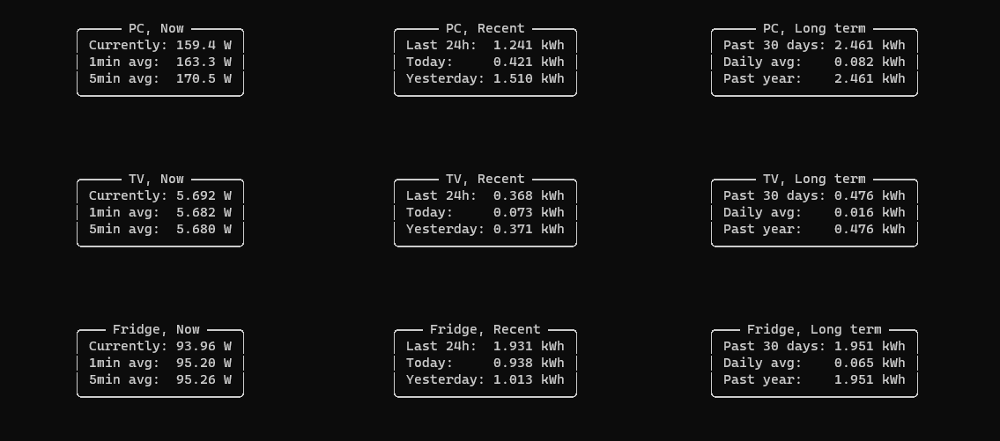

# P110Monitor

A simple CLI python app for monitoring TP-Link Tapo P110 power consumption using [TapoP100
](https://github.com/fishbigger/TapoP100) and [Rich](https://github.com/Textualize/rich)

## Screenshot

